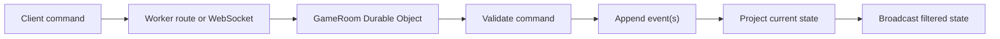

# Architecture

Cepheus Online is planned as a full-stack TypeScript application with a small
browser client and server-authoritative game rooms.

## Layers

```text
src/shared/      domain types, commands, events, projectors, rules, schemas
src/server/      Cloudflare Worker routes and Durable Objects
src/client/      browser app, Canvas board, CSS, local reactive state
data/            JSON rulesets and imported SRD-derived data
docs/            design, migration, and operating notes
```

## Runtime Model

The server owns game truth. Clients submit commands. The room validates each
command against current state, appends one or more events, projects the next
state, and broadcasts a state-bearing message.

This is a CQRS-style split: commands are the only mutation path, while reads
return filtered projections from the event stream.



## Durable Objects

Expected classes:

- `GameRoomDO`: one live campaign/game room, ordered command processing,
  WebSockets, event stream, checkpoints, presence.
- `DiscordInstallDO` or D1-backed routes: Discord install/session bookkeeping if
  needed.

The room should be small and focused. Game rules live in `src/shared`, not in
the Durable Object class.

Ruleset selection is room state. `CreateGame` may carry a `rulesetId`,
`GameCreated` persists it, and `GameState.rulesetId` is projected from the
event stream. Bundled Cepheus rules live as JSON under `data/rulesets/` and are
decoded by shared rules code; do not convert rules tables into hand-maintained
TypeScript constants.

## Persistence

- Durable Object storage: live event stream, checkpoints, active room metadata.
- R2: uploaded board images, token images, final archived game bundles.
- D1: user records, Discord account links, game index, public listings, audit
  metadata.

Event streams should be chunked in Durable Object storage rather than kept as
one large array. Checkpoints should be saved at natural boundaries so reconnect
and replay read the latest checkpoint plus a short event tail.

## Client

The browser client should prefer:

- plain DOM and CSS
- Canvas 2D for boards and maps
- small local signals/reactive utilities
- browser WebSocket and Fetch
- no runtime UI framework by default

The current shell source is in `src/client/app` and is embedded into
Worker-served assets with `npm run build:client`. The Worker serves the
generated asset module from `src/server` without importing client source at
runtime.

The app is a PWA. The shell owns install metadata, a web app manifest, service
worker registration, controller-change reload, and an install prompt. The
service worker may cache only app-shell assets and navigations; room state,
commands, health checks, and future API routes must always go to the network.

WebGL can be introduced later for a specific board mode, not as the default.

## State Boundaries

Separate state into:

- authoritative game state projected from events
- local UI state that can be discarded
- ephemeral presence/awareness
- optional collaborative document state for notes

These must not be blurred into one mutable object.

## Source Boundaries

`src/shared` should be side-effect-free and deterministic. `src/server` owns
Cloudflare bindings and persistence. `src/client` owns DOM, Canvas, CSS,
browser storage, and WebSocket client behavior.

See [patterns.md](patterns.md) and
[development standards](../engineering/development-standards.md). See
[map assets and line of sight](map-assets-and-los.md) for the local-only
geomorph asset policy and the planned occlusion sidecar model.
