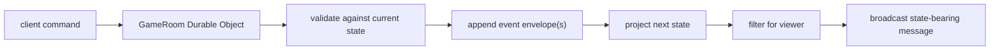

# Patterns

These are the implementation patterns to use when the skeleton becomes a real
application. They are adapted from Delta-V for a Cepheus campaign tool rather
than copied as-is.

## Event-Sourced Room State

Every authoritative mutation in a room should be a command that produces one or
more events. Live state is a projection of the event stream plus optional
checkpoints.



This avoids the old DataStore failure mode where multiple clients raced to
write whole nested objects.

## Event Envelopes

Persist domain events inside an envelope:

```ts
interface EventEnvelope {
  version: 1
  id: EventId
  gameId: GameId
  seq: number
  actorId: UserId | null
  createdAt: string
  event: GameEvent
}
```

The event payload says what happened. The envelope says when, where, and by
whom. `version` is the event envelope schema version. `seq` is the ordering
source of truth; timestamps are metadata.

## Chunked Persistence

Durable Object storage should not keep one giant event array per room. Use
fixed-size chunks such as:

```text
events:{gameId}:chunk:0
events:{gameId}:chunk:1
eventSeq:{gameId}
eventChunkCount:{gameId}
checkpoint:{gameId}:{seq}
```

Chunking keeps each value below platform limits and makes reconnect tail reads
cheap. Checkpoints should be saved at natural boundaries: session start,
combat/round boundary, character creation completion, or map scene changes.

## Single Publication Pipeline

There should be one server path that:

- validates a command
- calls shared rules code
- appends event envelopes
- saves checkpoints when needed
- reprojects for parity checks
- broadcasts filtered state
- records operational telemetry

Do not add separate "save then broadcast" paths for each feature. That is how
state drift starts.

## Side-Effect-Free Shared Code

Everything in `src/shared` should be deterministic and free of DOM, network,
storage, logging, and ambient randomness. Shared rules functions should accept
all inputs explicitly, including `rng: () => number` when dice or random tables
are involved.

This makes rules code testable, replayable, and usable on both client and
server.

## Viewer-Aware Filtering

Referee state is not just UI chrome. Hidden pieces, unrevealed maps, secret
NPCs, private notes, and GM-only handouts must be removed before any player
socket receives a state update.

Filtering should happen server-side at the broadcast/replay boundary, not in
the browser. Clients should never receive secrets they are not allowed to know.

## Client State

The browser has three state classes:

- authoritative state from the server
- local planning and UI state that can be discarded
- presence/awareness that can be rebuilt after reconnect

Only authoritative state is persisted as game truth. Local planning state is
for hover, selection, draft movement, unsubmitted form work, and temporary
canvas interactions.

## Input Pipeline

Raw browser events should not touch game logic directly:

1. Capture DOM/canvas input and translate it to input events.
2. Interpret input events with current client state in pure functions.
3. Dispatch typed commands through one command router.

The same command router should handle keyboard shortcuts, toolbar buttons,
touch gestures, and canvas interactions.

## Tiny Reactive Layer

Use `src/client/reactive.ts` selectively for UI state that needs automatic
fan-out. It is not a global game store. Authoritative state arrives from the
server; signals make local views update without pulling in React, MUI, or a
large state library.

Any view or controller that creates effects, listeners, or timers should own a
disposal scope and expose `dispose()`.

## DOM Boundary

Use `src/client/dom.ts` for simple views. Keep all `innerHTML` writes behind
`setTrustedHTML()` and `clearHTML()`. Player names, chat, notes, SRD text, and
Discord content should render as text unless a sanitizer is deliberately added
at that boundary.

## Protocol

Network messages should be discriminated unions keyed by `type`. Runtime
validation should happen before a message reaches command handling.

Every successful state-changing command should broadcast exactly one
state-bearing message. Clients replace their authoritative state wholesale.
Avoid optimistic mutation for game truth; use local planning state for fast UI
feedback.
